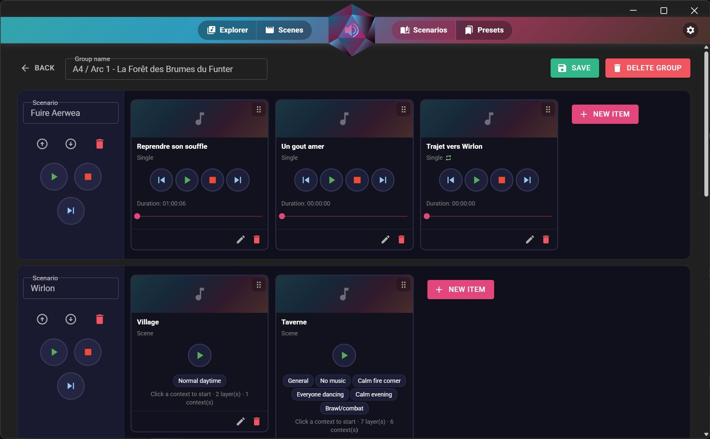
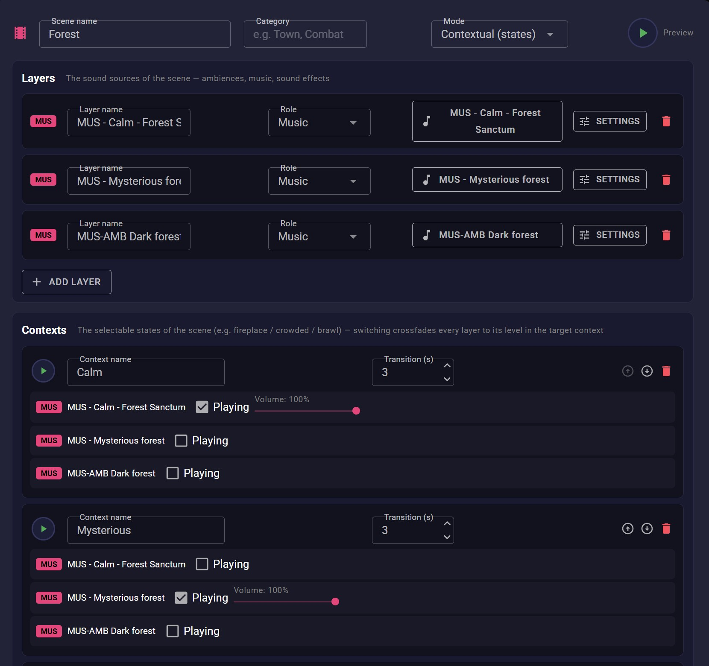
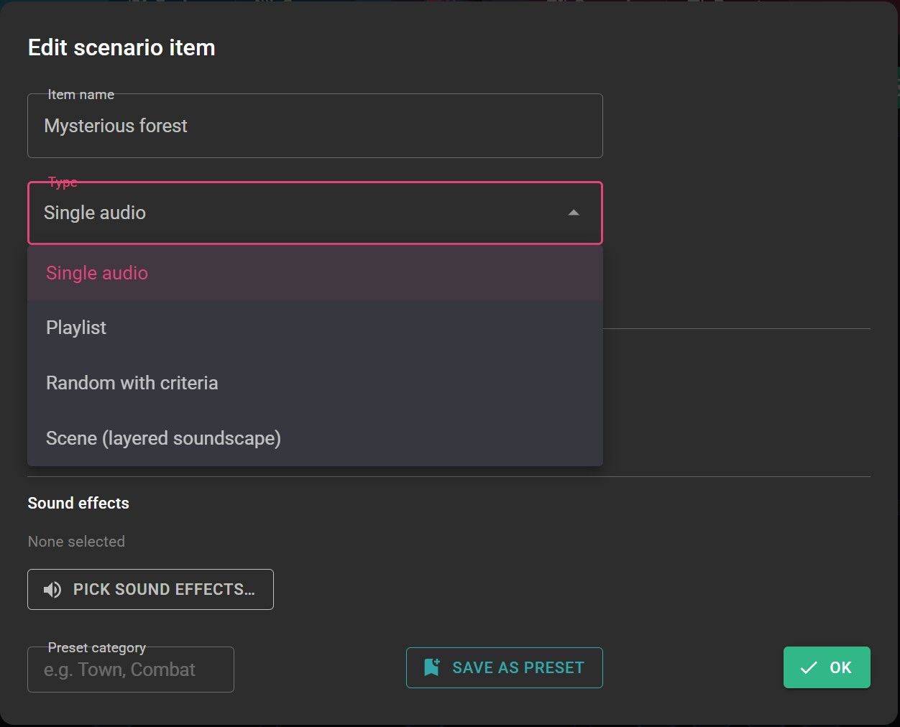
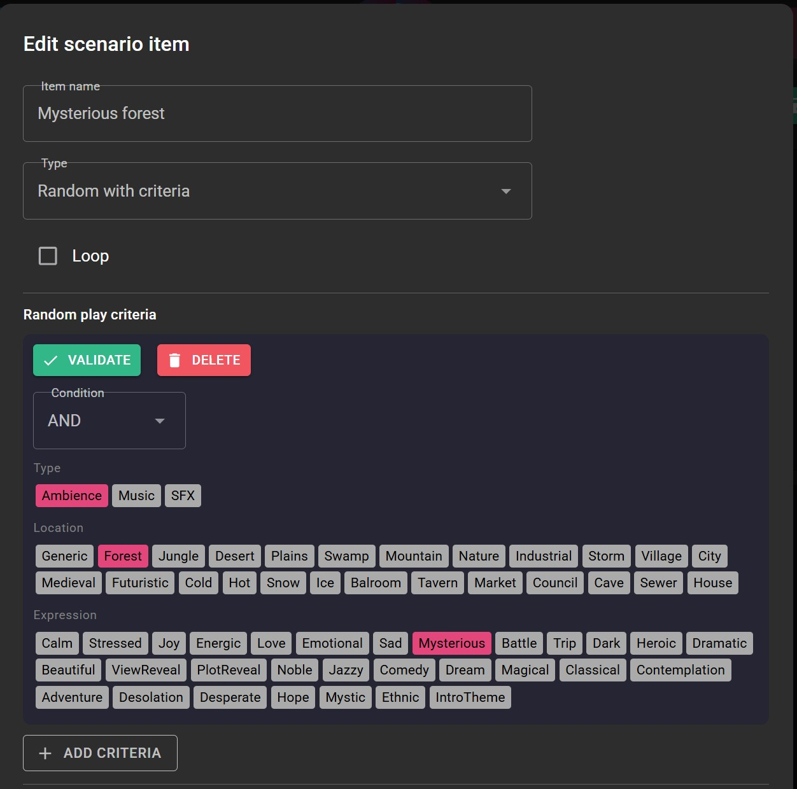
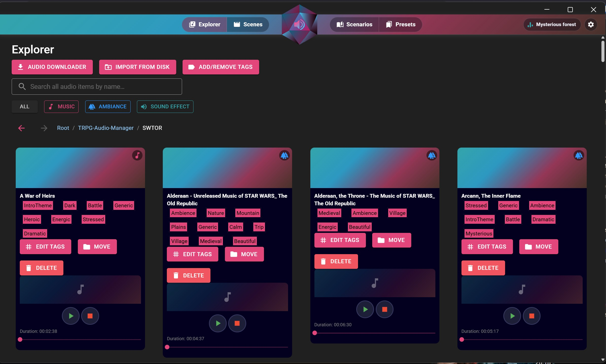
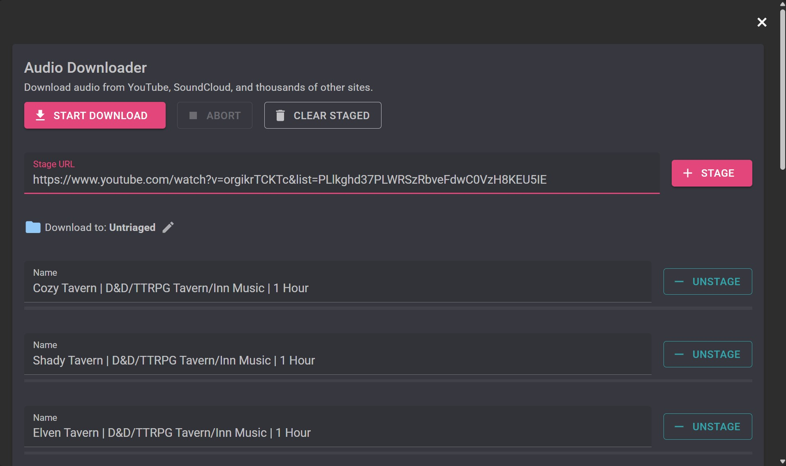
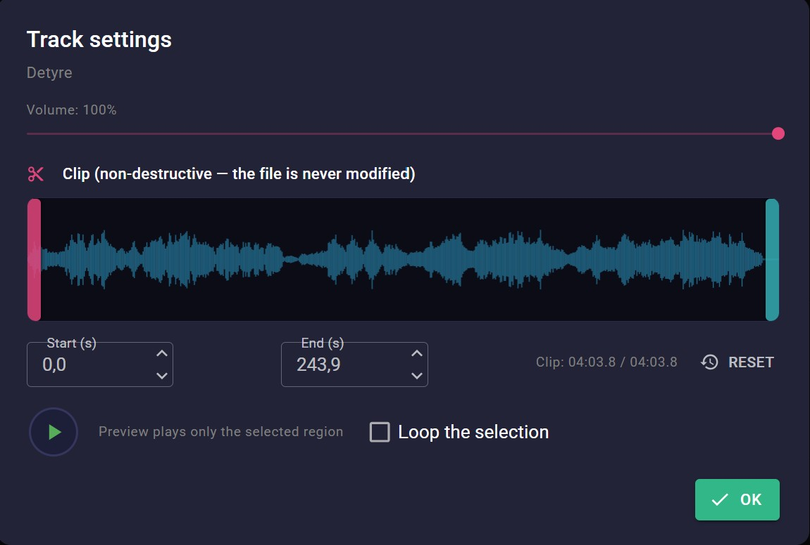
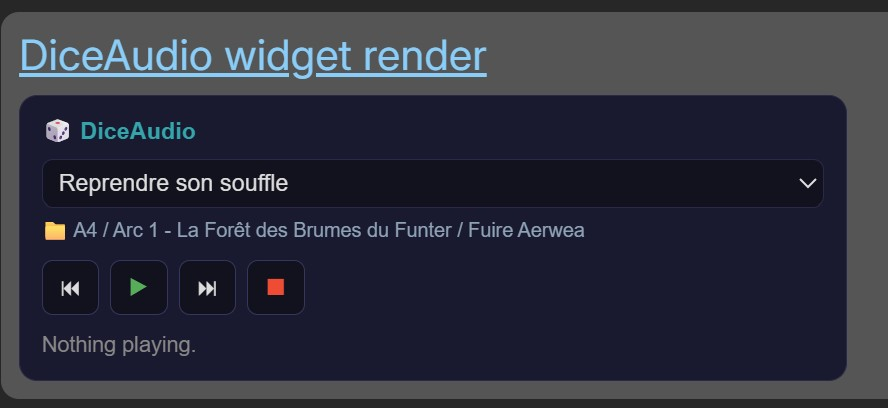

<p align="center">
   
</p>

<h1 align="center">DiceAudio</h1>

<p align="center">
   <a href="https://github.com/YannCharbon/DiceAudio/releases/latest"></a>
   
   
</p>

<p align="center">
   <a href="https://yanncharbon.github.io/DiceAudio/"><b>Website</b></a> &middot;
   <a href="https://github.com/YannCharbon/DiceAudio/releases/latest"><b>Download</b></a> &middot;
   <a href="https://yanncharbon.github.io/DiceCombats/"><b>DiceCombats</b></a>
</p>

DiceAudio helps you manage the audio of your tabletop RPG sessions. Collect the music, ambiences and
sound effects you use in a single library, build layered scenes that follow what happens at the table,
and drive the whole evening from one window instead of juggling media players.



---

## What it does

- **The audio library.** Your audio files are organised in folders and tagged in three categories: type
  (music, ambience or sound effect), location and expression. A search covers the whole library, filters
  narrow it down by type or by a tag expression such as "ambiance and mysterious and not combat", and
  the files themselves stay where you put them on your disk.
- **Importing your audio.** Download from YouTube, SoundCloud and thousands of other sites with the
  built-in downloader: stage several links, choose the destination folder and start. You can also import
  files you already have on your disk.
- **Track settings.** Each item has its own volume and can be clipped to the part you actually want to
  play. The clip is non-destructive, so the original file is never modified.
- **Scenes.** A scene is built from several layers, each one an ambience, a music track or a sound effect
  taken from your library, with its own role and playback settings.
- **Contexts.** A scene can have several contexts, which are the states it can be in, such as calm,
  mysterious or brawl. Each context stores a level for every layer, and switching to it crossfades the
  whole scene over the transition time you set.
- **Scenarios.** A scenario is the ordered list of what you plan to play during a session, and scenarios
  are gathered in groups, typically one per adventure or story arc. An item can be a single track, a
  playlist, a random selection based on tag criteria, or a whole scene.
- **Presets.** Any scenario item can be saved as a preset with a category, then reused to start a new
  scene or a new item without building it again.
- **Remote control.** DiceAudio can start a local HTTP server which exposes playback, navigation inside a
  scenario and scene contexts, so another application can drive the sound.
- **On your machine.** The library points to the audio files you already have and the settings stay on
  your computer. The interface is in English and the app runs on Windows. Mobile is not available for
  now, it might come in the future. DiceAudio is free and open source under GPL-3.0.

---

## A look at the app

These screenshots are taken from a library which is really used, so they show what a prepared session
looks like.

### Scenes and contexts

A scene is made of layers and contexts, and both are edited on the same page. Each layer points to an
item of your library and keeps its own settings. Each context stores which layers are playing and at
which volume, together with the time the crossfade should take. Switching from Calm to Mysterious during
the session is then a single click.



### Scenarios

A group gathers the scenarios of an adventure, and each scenario lists what you plan to play in order.
Single tracks come with their own transport and progress bar, while scenes show their contexts as
buttons, so you start the right state directly from here.


### What a scenario item can be

An item is not necessarily a track: it can be a playlist, a random selection based on criteria, or a full
scene. Sound effects can be attached to it, and the whole item can be saved as a preset for later.



### Random playback with criteria

Instead of choosing a track, you describe what you want and let DiceAudio pick. Criteria are built from
the tag categories and combined with AND or OR, so a forest ambience with a mysterious expression plays
something different every time the party enters the woods.



### The library

Every item keeps its tags, its place in the folders and its playback settings, and can be played, edited,
moved or deleted from its card.




### The audio downloader

Paste one or several links, check what is staged, choose the destination folder and start the download.
The tracks land directly in your library, ready to be tagged.



### Track settings and clipping

Set the volume of a track and, if you only need a part of it, drag the start and the end of the clip on
the waveform. The preview plays only the selected region and the original file is never modified.



More screenshots on the [website](https://yanncharbon.github.io/DiceAudio/#screenshots).

---

## Remote control and Trilium Note integration

DiceAudio embeds an HTTP server and can be controlled with an HTTP API from any external service. It also
ships with a Trilium Note widget which allows you to embed the DiceAudio player within any of your
Trilium Notes. This is very convenient because it allows you to include the right audio sample directly
where it is needed within your scenario or script.

<p align="center">
   
</p>

### How to setup the Trilium Widget

- Create a new Trilium code note called `DiceAudioWidgetHTML` with the language set to **HTML**, and paste
  the content of [DiceAudioWidgetHTML.html](TriliumPlugin/trilium/DiceAudioWidgetHTML.html) into it.
- Create a child code note of it with the language set to **JavaScript frontend**, and paste the content
  of [DiceAudioWidgetJS.frontend.js](TriliumPlugin/trilium/DiceAudioWidgetJS.frontend.js) into it.
- Create another new note called `DiceAudio widget render`. In the note's **Basic properties**, set the
  note type to **Render Note**. Then in the note's **Owned Attributes**, add
  `~renderNote=DiceAudioWidgetHTML`.
- After following these steps, the note should render. When DiceAudio is started, it should not print
  `⚠ DiceAudio not reachable.`
- You are now able to include this note anywhere by clicking the **Paragraph menu** -> **Insert
  (+ button)** -> **Insert note** -> select the `DiceAudio widget render` note.

### The control API

The control server is disabled by default and is switched on in the settings. Once running it answers on
`http://localhost:8765`:

| Route | Effect |
|---|---|
| `GET /api/state` | What is currently playing |
| `GET /api/groups` | The scenario groups |
| `POST /api/play`, `/api/pause`, `/api/stop` | Transport |
| `POST /api/next`, `/api/prev` | Move through the current scenario |
| `POST /api/scene/advance`, `/api/scene/goto` | Move a scene to another context |
| `POST /api/volume` | Set the master level of a scenario (`{scenarioId?, volume?, muted?}`, volume `0..1`) |

---

## One ecosystem

The Dice ecosystem has currently two apps: DiceAudio and DiceCombats. Please also have a look at
[**DiceCombats**](https://github.com/YannCharbon/DiceCombats) to complete what your table needs.

DiceCombats manages the combats of your table: creatures built with the fields your system needs,
initiative, damage types and resistances, and a combat log. Its automations can send HTTP requests when
something happens during the fight, and DiceAudio listens on a local one, so a hit landing at the table
can start a scene or move it along.

Both applications are free, open source under GPL-3.0, and built the same way with .NET MAUI and Blazor.

---

## Installation

There is no installer and no account to create. The application stores its data on your machine.

Get the latest build here: [](https://github.com/YannCharbon/DiceAudio/releases/latest)

- **Windows**: download the ZIP from the latest release, extract it anywhere and run `DiceAudio.exe`. You
  can pin it to the start menu if you want it close.
- **Android**: the app is currently not available for mobile. This might come in the future.

## Build from source

You need the [.NET 10 SDK](https://dotnet.microsoft.com/download) and the MAUI workloads installed.
Everything else is restored from NuGet. The solution also opens in Visual Studio.

```bash
git clone https://github.com/YannCharbon/DiceAudio.git
cd DiceAudio
dotnet workload install maui-windows maui-android
dotnet publish DiceAudio/DiceAudio.csproj -f net10.0-windows10.0.19041.0 -c Release -p:RuntimeIdentifierOverride=win10-x64 -p:WindowsPackageType=None -p:IncludeAllContentForSelfExtract=true -p:PublishReadyToRun=true -p:IncludeNativeLibrariesForSelfExtract=true
```

The binaries are produced in `DiceAudio/bin/Release/`.

---

## Contribute

- **Issues and ideas**: if you find a bug or if you would like a new feature, you can open an issue on the
  repository. [](https://github.com/YannCharbon/DiceAudio/issues)
- **Pull requests**: contributions are welcome. Please document them and follow the style of the code
  around them. [](https://github.com/YannCharbon/DiceAudio/pulls)
- **License**: the project is published under GPL-3.0-or-later, see [LICENSE](LICENSE). The source code is
  open and will stay open.

## Support the project

This project is free and I develop it on my free time, so the updates and the fixes can take some time to
arrive. If DiceAudio is useful at your table, a donation helps me to keep working on it.

[](https://www.paypal.com/donate/?hosted_button_id=4X9ZURL5T4E6N)

---

## AI usage notice

I started developing DiceAudio in September 2023 in the context of an old non-public released project,
when I did not yet consider AI coding tools reliable enough for this kind of work. Until early 2026, I
wrote the entire codebase myself. As these tools have improved rapidly, I have started using Claude Code
to help me implement new features faster. I enjoy writing code, but what I value even more is having time
to work on my TTRPG scenarios. Using AI for part of the development work gives me more time for that
creative side of the hobby. If the use of AI in the project is a concern for you, I completely understand
if you would rather not use DiceAudio. I do, however, want to make one thing clear: AI is a development
tool here. The features, design choices and overall direction of DiceAudio still come from me, as a game
master building a tool for other game masters.

---

Thank you for choosing DiceAudio. Happy gaming!
